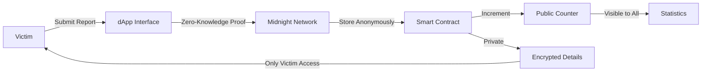

<div align="center">

# 🛡️ Anonymous Stalking Report Registry

### *Privacy-First Incident Reporting on Midnight Network*

[](https://midnight.network/)
[](https://midnight.network/)
[](LICENSE)
[](https://github.com/Debjanimandal/Anonymous-Stalking-#-deployed-smart-contract)

**Empowering victims to report stalking incidents anonymously while creating immutable, verifiable evidence on the blockchain.**

**🔗 Contract Address:** `f84c5ddd658f7292adeeacd5c17d446329a228b9d53cfab0b16fd7533dcbb6db`

[Features](#-features) • [How It Works](#-how-it-works) • [Getting Started](#-getting-started) • [Contract Details](#-deployed-smart-contract)

</div>

---

## 📖 About The Project

The **Anonymous Stalking Report Registry** is a decentralized application (dApp) built on the Midnight Network that enables victims of stalking to:

- 📝 **Submit anonymous reports** of stalking incidents
- 🔐 **Maintain complete privacy** through zero-knowledge proofs
- ⚖️ **Create immutable legal evidence** stored on-chain
- 🕐 **Timestamp incidents** with cryptographic verification
- 🌍 **Log locations** without revealing reporter identity

### 🎯 Why This Matters

Stalking victims often face the difficult choice between staying silent or exposing themselves to potential retaliation. This dApp solves this dilemma by leveraging **zero-knowledge cryptography** to allow victims to:

1. Create a permanent, tamper-proof record of incidents
2. Build a documented pattern of behavior for legal proceedings
3. Stay completely anonymous to the public and potential attackers
4. Prove incidents occurred without revealing personal information

---

## ✨ Features

### 🔒 **Privacy-Preserving**
- **Zero-Knowledge Proofs**: Report incidents without revealing your identity
- **Anonymous Submissions**: No personal information required or stored
- **Encrypted Data**: All sensitive details protected by cryptography

### 📊 **Transparent Yet Private**
- **Public Counter**: Total reports visible for awareness and statistics
- **Individual Privacy**: Reporter identities remain completely hidden
- **Immutable Records**: Blockchain ensures reports cannot be altered or deleted

### ⚡ **Simple & Accessible**
- **One-Click Reporting**: Submit reports through an intuitive interface
- **No Registration Required**: Start reporting immediately
- **Cross-Platform**: Works on any device with a web browser

### 🏛️ **Legal Evidence**
- **Timestamped Entries**: Cryptographically verified submission times
- **Geolocation Support**: Optional location attestation (ZK-protected)
- **Verifiable Records**: Generate proof of reports for legal proceedings

---

## 🚀 How It Works



1. **Victim submits a report** through the web interface
2. **Zero-knowledge proof generated** proving validity without revealing identity
3. **Report stored on Midnight blockchain** with encrypted details
4. **Public counter increments** showing total reports (for awareness)
5. **Victim retains private access** to their own report details

---

## 📜 Deployed Smart Contract

<div align="center">

### 🎉 Live on Midnight Network (Undeployed)

```
f84c5ddd658f7292adeeacd5c17d446329a228b9d53cfab0b16fd7533dcbb6db
```

**Contract Functions:**
- `submitReport()` - Submit an anonymous stalking incident report
- `totalReports` - View the total number of reports submitted (public)

</div>

---

## 📦 Prerequisites

Before you begin, ensure you have the following installed:

- 🟢 [Node.js](https://nodejs.org/) (v23+) & [npm](https://www.npmjs.com/) (v11+)
- 🐳 [Docker](https://docs.docker.com/get-docker/)
- 📦 [Git LFS](https://git-lfs.com/) (for large files)
- 🔧 [Compact](https://docs.midnight.network/relnotes/compact-tools) (Midnight developer tools)
- 💼 [Lace Wallet](https://chromewebstore.google.com/detail/hgeekaiplokcnmakghbdfbgnlfheichg) (Browser extension)
- 💧 [Midnight Faucet](https://faucet.preview.midnight.network/) (Get test tokens)

### ⚠️ Known Issues

- There's a not-yet-fixed bug in the arm64 Docker image of the proof server.
- **Workaround**: Use Bricktower proof server: `bricktowers/proof-server:6.1.0-alpha.6`

---

## 🛠️ Getting Started

### 1️⃣ Install Git LFS

```bash
# For Windows (using Chocolatey)
choco install git-lfs

# For Mac
brew install git-lfs

# For Linux (Fedora/RHEL)
sudo dnf install git-lfs

# Initialize Git LFS
git lfs install
```

### 2️⃣ Install Compact Tools

```bash
# Install the latest Compact tools
curl --proto '=https' --tlsv1.2 -LsSf \
  https://github.com/midnightntwrk/compact/releases/latest/download/compact-installer.sh | sh
```

```bash
# Install the compiler (version 0.27)
compact update +0.27.0
```

### 3️⃣ Verify Installation

```bash
# Check all required versions
node -v        # Should be v23+
npm -v         # Should be v11+
docker -v      # Should be installed
git lfs version
compact check  # Should show v0.27+
```

### 4️⃣ Clone & Install Project

```bash
# Clone the repository
git clone <your-repo-url>
cd midnight-starter-template-windows-main

# Install Git LFS files (important for cryptographic keys!)
git lfs pull

# Install all dependencies
npm install

# Build the project
npm run build
```

### 5️⃣ Setup Environment Variables

**For CLI Tools:**
- Navigate to `report-registry-cli/`
- Copy `.env_template` to `.env`
- Configure your network settings

**For Frontend:**
- Navigate to `frontend-vite-react/`
- Copy `.env_template` to `.env`
- Set contract address and network endpoints

---

## 🎮 Usage

### Running on Undeployed Network (Local Development)

```bash
# Terminal 1: Setup standalone network
npm run setup-standalone

# Terminal 2: Start the frontend
npm run dev:frontend
```

### Running on Preview Network

```bash
# Start the frontend (connects to preview network)
npm run dev:frontend
```

Then open your browser to `http://localhost:5173`

### Submitting a Report

1. **Connect your Lace wallet** to the dApp
2. **Ensure you have test tokens** from the faucet
3. **Click "Submit Report"** button
4. **Your report is submitted anonymously** with zero-knowledge proof
5. **View the updated total reports counter** (your identity remains hidden)

---

## 📁 Project Structure

```
anonymous-stalking-report-registry/
│
├── 🔧 report-registry-cli/          # Command-line interface tools
│   ├── src/
│   │   ├── api.ts                    # API interactions
│   │   ├── config.ts                 # Configuration
│   │   └── test/                     # Test suites
│   └── package.json
│
├── 📜 report-registry-contract/      # Smart contract
│   ├── src/
│   │   ├── counter.compact           # Main contract code
│   │   ├── deploy.ts                 # Deployment script
│   │   └── managed/                  # Compiled contract assets
│   │       └── counter/
│   │           ├── keys/             # Cryptographic keys (Git LFS)
│   │           └── zkir/             # Zero-knowledge IR
│   └── deployment.json               # Deployment details
│
├── 🎨 frontend-vite-react/           # Web interface
│   ├── src/
│   │   ├── components/               # UI components
│   │   ├── modules/midnight/         # Midnight SDK integration
│   │   └── pages/                    # Application pages
│   └── public/
│
├── 📄 package.json                   # Root workspace config
├── 📄 turbo.json                     # Turborepo configuration
└── 📖 README.md                      # You are here!
```

---

## 🔬 Technology Stack

<div align="center">

| Technology | Purpose |
|------------|---------|
|  | Zero-knowledge blockchain platform |
|  | Smart contract language |
|  | User interface framework |
|  | Type-safe development |
|  | Fast frontend tooling |
|  | JavaScript runtime |

</div>

---

## 🧪 Testing

```bash
# Test the smart contract
cd report-registry-contract
npm run test

# Test the CLI
cd report-registry-cli
npm run test-undeployed

# Test on preview network
npm run test-preview
```

---

## 🤝 Contributing

Contributions are what make the open-source community amazing! Any contributions you make are **greatly appreciated**.

1. Fork the Project
2. Create your Feature Branch (`git checkout -b feature/AmazingFeature`)
3. Commit your Changes (`git commit -m 'Add some AmazingFeature'`)
4. Push to the Branch (`git push origin feature/AmazingFeature`)
5. Open a Pull Request

### Development Workflow

```bash
# Create a new feature branch
git checkout -b feature/your-feature-name

# Make your changes and test
npm run build
npm run test

# Commit with descriptive messages
git commit -m "feat: add new feature description"

# Push and create PR
git push origin feature/your-feature-name
```

---

## 📋 Roadmap

- [x] ✅ Anonymous report submission
- [x] ✅ Public report counter
- [x] ✅ Zero-knowledge privacy
- [ ] 🔄 Location attestation system
- [ ] 🔄 Report verification for authorities
- [ ] 🔄 Multi-language support
- [ ] 🔄 Mobile application
- [ ] 🔄 Report analytics dashboard
- [ ] 🔄 Integration with legal support services

---

## 📄 License

Distributed under the Apache 2.0 License. See `LICENSE` for more information.

```
Copyright (C) 2025 Midnight Foundation
SPDX-License-Identifier: Apache-2.0
```

---

## 🙏 Acknowledgments

- [Midnight Network](https://midnight.network/) - Zero-knowledge blockchain platform
- [Compact Language](https://docs.midnight.network/) - Smart contract development
- [Midnight Community](https://discord.gg/midnight) - Support and resources

---

## 📞 Support & Contact

- 📚 **Documentation**: [Midnight Docs](https://docs.midnight.network/)
- 💬 **Discord**: [Midnight Community](https://discord.gg/midnight)
- 🐦 **Twitter**: [@MidnightNtwrk](https://twitter.com/MidnightNtwrk)
- 🌐 **Website**: [midnight.network](https://midnight.network/)

---

## ⚠️ Disclaimer

This is a proof-of-concept application built for educational and demonstration purposes. While it implements strong cryptographic privacy protections, users should:

- Understand the legal requirements in their jurisdiction for reporting crimes
- Consult with legal professionals before relying solely on blockchain evidence
- Use this tool as part of a broader safety and legal strategy
- Not substitute this for official police reports or legal proceedings

**Your safety is paramount. If you're in immediate danger, contact local emergency services immediately.**

---

<div align="center">

### 💜 Built with Privacy & Purpose

*Empowering victims, protecting identities, creating change.*

**Made with [Midnight Network](https://midnight.network/) | Zero-Knowledge Technology**

[⬆ Back to Top](#️-anonymous-stalking-report-registry)

</div>
